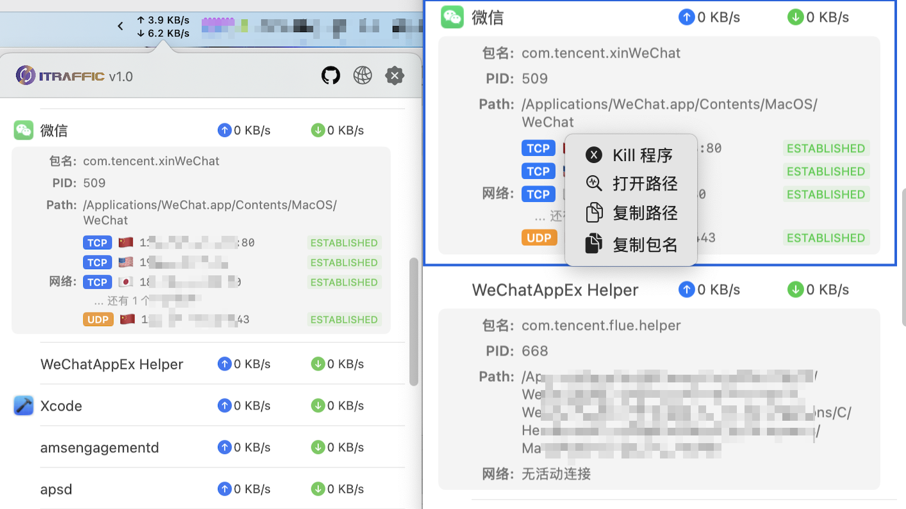

# ITraffic-monitor-for-mac
Monitor for displaying process traffic on Mac Status bar

## MacOS version required
The macOS version  >= 15.6, since the project use swiftUI

## Install & Update
One of the following way is fine

1. Download the zip file from [the latest page](https://github.com/9ouu/ITraffic-monitor-for-mac/releases)

## Snapshot

